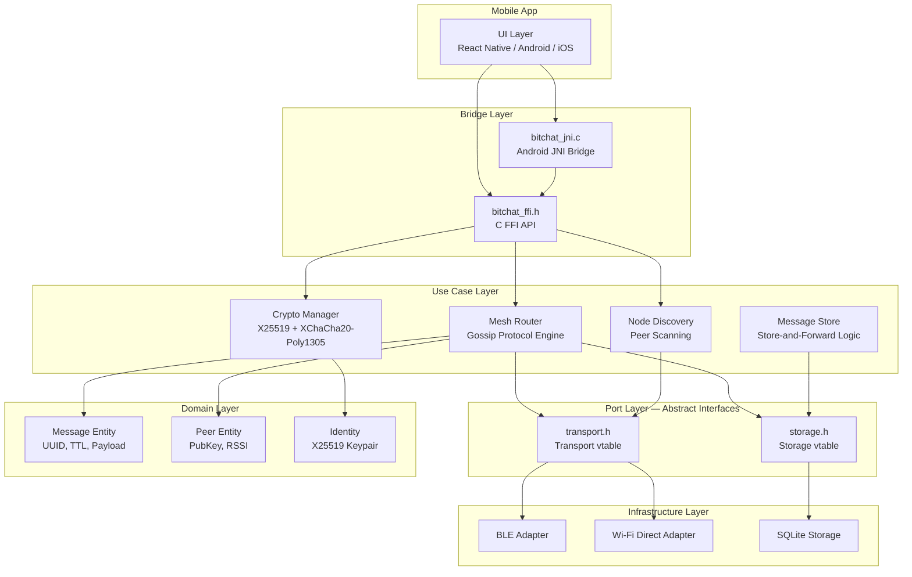

# BitChat

**Peer-to-peer offline messaging — no internet, no servers, no compromise.**

BitChat is a censorship-resistant, disaster-resilient chat application that
operates entirely offline using Bluetooth Low Energy (BLE) and Wi-Fi Direct.
Messages are routed through a mesh network of nearby devices using a Gossip
Protocol with Store-and-Forward, ensuring delivery even when sender and
recipient are never online at the same time.

## Core Principles

- **Zero infrastructure** — No servers, no cloud, no internet connection required.
- **Absolute privacy** — End-to-end encryption (X25519 ECDH + XChaCha20-Poly1305). Identity is a cryptographic keypair, not a phone number.
- **Censorship resistant** — No central authority can block, monitor, or shut down the network.
- **Disaster resilient** — Works when cellular and internet infrastructure is down.

## How It Works

### Gossip Protocol + Store-and-Forward

```
Alice wants to send a message to Dave, but they're not in direct range.

  Alice --[BLE]--> Bob --[Wi-Fi]--> Carol --[BLE]--> Dave

1. Alice encrypts the message for Dave's public key
2. Alice broadcasts to all reachable peers (Bob)
3. Bob doesn't know Dave, but STORES the message and FORWARDS it
4. Each hop decrements the TTL counter (default: 10 hops)
5. Carol receives it, recognizes Dave as a neighbor, delivers it
6. Duplicate messages are filtered by UUID (deduplication cache)
```

Messages that can't be delivered immediately are stored locally (SQLite) for up
to 72 hours and retried whenever new peers come into range. The TTL mechanism
prevents messages from circulating indefinitely.

### Message Deduplication

Every message carries a random 128-bit UUID. Each node maintains a hash set of
recently-seen UUIDs (capacity: 10,000, with LRU eviction). When a message
arrives with a UUID already in the set, it is silently dropped — preventing
broadcast storms and message loops.

### Fanout Control

To prevent flooding, each node forwards a message to at most **3 neighbors**
(configurable). This provides a good balance between delivery probability and
network load in typical mesh densities.

## Architecture

The C core follows Clean Architecture with strict layer separation:



### Layer Responsibilities

| Layer | Purpose | Key Files |
|---|---|---|
| **Domain** | Core entities — no dependencies on external code | `message.h`, `peer.h`, `identity.h` |
| **Port** | Abstract interfaces (vtables) for dependency inversion | `transport.h`, `storage.h` |
| **Use Case** | Business logic — gossip routing, encryption, discovery | `mesh_router.h`, `crypto_manager.h`, `node_discovery.h` |
| **Infrastructure** | Concrete adapters — BLE, Wi-Fi Direct, SQLite | `transport_ble.c`, `storage_sqlite.c` |
| **Bridge** | FFI surface for mobile platforms | `bitchat_ffi.h`, `bitchat_jni.c` |

## Building

### Prerequisites

- C11-compatible compiler (GCC, Clang)
- CMake >= 3.14
- [libsodium](https://doc.libsodium.org/) >= 1.0.18
- SQLite3

**Arch Linux:**
```bash
sudo pacman -S cmake libsodium sqlite
```

**Ubuntu/Debian:**
```bash
sudo apt install cmake libsodium-dev libsqlite3-dev pkg-config
```

**macOS:**
```bash
brew install cmake libsodium sqlite pkg-config
```

### Build & Test

```bash
git clone https://github.com/user/BitChat.git
cd BitChat
git submodule update --init   # pulls Unity test framework
mkdir build && cd build
cmake ..
make
ctest --verbose
```

### Android (NDK cross-compilation)

```bash
cmake -DCMAKE_TOOLCHAIN_FILE=$NDK/build/cmake/android.toolchain.cmake \
      -DANDROID_ABI=arm64-v8a \
      -DBITCHAT_BUILD_JNI=ON \
      -DBITCHAT_BUILD_TESTS=OFF \
      ..
make
```

## API Quick Start

```c
#include "bitchat/bridge/bitchat_ffi.h"

int main(void) {
    // Initialize
    bitchat_init("/path/to/messages.db");

    // Generate identity
    uint8_t my_pubkey[32];
    bitchat_generate_identity(my_pubkey);

    // Send a message
    uint8_t recipient[32] = { /* recipient's public key */ };
    bitchat_send_message(recipient, (uint8_t *)"Hello!", 6);

    // Poll for incoming messages
    uint8_t buf[4096];
    size_t msg_len;
    uint8_t sender[32];
    bitchat_poll_messages(buf, sizeof(buf), &msg_len, sender);

    // Periodic maintenance (call every ~5 seconds)
    bitchat_tick();

    // Cleanup
    bitchat_shutdown();
}
```

## Project Structure

```
BitChat/
├── include/bitchat/
│   ├── domain/          # Core entities (message, peer, identity)
│   ├── usecase/         # Business logic (router, crypto, discovery)
│   ├── port/            # Abstract interfaces (transport, storage)
│   └── bridge/          # Public FFI API
├── src/
│   ├── domain/          # Entity implementations
│   ├── usecase/         # Logic implementations
│   ├── infra/           # BLE, Wi-Fi, SQLite adapters
│   └── bridge/          # FFI + JNI implementations
├── tests/               # Unity test suite
├── third_party/         # Unity framework, libsodium
└── CMakeLists.txt       # Build configuration
```

## Security Model

- **Key exchange**: X25519 Elliptic-Curve Diffie-Hellman
- **Encryption**: XChaCha20-Poly1305 (AEAD)
- **Nonce**: 192-bit random (eliminates nonce-reuse risk)
- **Identity**: Keypair-based (no phone numbers, no accounts)
- **Key wiping**: Secret keys are zeroed with `sodium_memzero()` on shutdown
- **No metadata leakage**: Messages carry only public keys, never IP addresses or device IDs

## License

MIT
